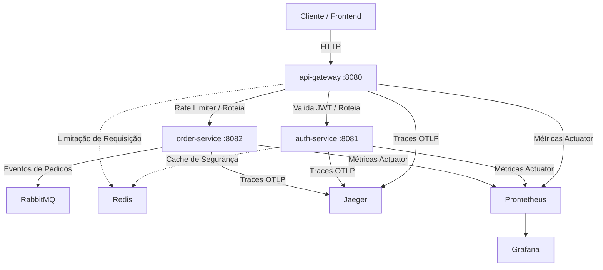

# 🚀 Plataforma de Microsserviços v2

Uma arquitetura de microsserviços robusta e moderna construída com **Java 21** e o ecossistema **Spring Boot 3.5**. Este projeto foi desenhado utilizando as melhores práticas de microsserviços para criar um sistema de alta performance, seguro, resiliente e altamente observável.

---

## 🛠️ Tecnologias & Ferramentas Utilizadas

O projeto utiliza uma pilha tecnológica de ponta para garantir escalabilidade e monitoramento em tempo real:

*   **Linguagem & Framework**: Java 21, Spring Boot 3, Maven (Multi-Módulos).
*   **Segurança**: Spring Security, JWT (JSON Web Tokens) com decodificação e validação personalizada.
*   **Banco de Dados**: PostgreSQL (Persistência relacional), Flyway (Versionamento de banco de dados).
*   **Cache & Rate Limiting**: Redis (Armazenamento em memória rápido).
*   **Mensageria**: RabbitMQ (Comunicação assíncrona orientada a eventos).
*   **Observabilidade & Tracing**:
    *   **Jaeger**: Rastreamento distribuído de requisições de ponta a ponta.
    *   **Prometheus**: Coleta de métricas em tempo real.
    *   **Grafana**: Criação de dashboards visuais analíticos.
*   **Containerização**: Docker & Docker Compose (Orquestração local de infraestrutura).

---

## 🏗️ Arquitetura do Sistema

O projeto é dividido de forma modular e altamente desacoplada:



### 🛰️ Detalhamento dos Módulos

1.  **[`api-gateway`](./api-gateway)**:
    *   O ponto único de entrada do sistema (Porta `8080`).
    *   Responsável pelo roteamento dinâmico das requisições para os microsserviços internos.
    *   **Filtro JWT**: Intercepta rotas privadas, valida o token e injeta a identidade do usuário (`X-User-Id`) nos cabeçalhos downstream.
    *   **Rate Limiting**: Utiliza Redis com o algoritmo *Token Bucket* para limitar abusos e ataques de negação de serviço.
2.  **[`auth-service`](./auth-service)**:
    *   Gerencia usuários, credenciais e sessões (Porta `8081`).
    *   Responsável pelo cadastro, login, geração e validação de tokens JWT.
    *   Usa o PostgreSQL (`auth_db`) gerenciado com migrações Flyway.
3.  **[`order-service`](./order-service)**:
    *   Gerencia os pedidos e o fluxo de checkout (Porta `8082`).
    *   Garante resiliência e controle com validação de **chaves de idempotência** (impedindo pedidos duplicados).
    *   Usa o PostgreSQL (`order_db`) e dispara mensagens e eventos no RabbitMQ para comunicação assíncrona de fluxos de negócio.

---

## 🐳 Infraestrutura Local (Docker)

O arquivo [`docker-compose.yml`](./docker-compose.yml) centraliza todos os serviços de suporte necessários para rodar a aplicação localmente:

| Serviço | Imagem Docker | Porta Exposta | Função no Sistema |
| :--- | :--- | :--- | :--- |
| **PostgreSQL** | `postgres:15-alpine` | `5432` | Bancos relacionais (`auth_db` e `order_db`) |
| **Redis** | `redis:7-alpine` | `6379` | Cache e armazenamento para o Rate Limiter do Gateway |
| **RabbitMQ** | `rabbitmq:3-management` | `5672`, `15672` | Mensageria assíncrona e painel administrativo |
| **Prometheus** | `prom/prometheus` | `9090` | Coletor de métricas de performance das aplicações |
| **Grafana** | `grafana/grafana` | `3000` | Painéis e visualização de dashboards de métricas |
| **Jaeger** | `jaegertracing/all-in-one` | `16686`, `4318` | Interface web e coletor OTLP de tracing distribuído |

---

## 🔒 Variáveis de Ambiente & Segurança

Para evitar expor credenciais sensíveis e chaves de segurança (como o segredo JWT) no GitHub, o projeto utiliza **importação nativa de arquivos `.env`**.

### Como configurar localmente:

1.  Na pasta raiz do projeto, você encontrará o arquivo [`.env.example`](./.env.example).
2.  Duplique o arquivo e renomeie a cópia para `.env`:
    ```bash
    cp .env.example .env
    ```
3.  Abra o arquivo `.env` e configure suas variáveis locais (elas já estão pré-configuradas para o ambiente Docker padrão):
    ```env
    # JWT Security
    JWT_SECRET=

    # Database Credentials
    DB_USERNAME=
    DB_PASSWORD=
    ```

> [!IMPORTANT]
> O arquivo `.env` está adicionado ao `.gitignore` e **nunca** deve ser commitado no repositório.

---

## 🚀 Como Executar o Projeto

### Pré-requisitos
*   Java 21 instalado
*   Maven 3.8+ instalado
*   Docker & Docker Desktop instalados e rodando

### Passo 1: Iniciar os Serviços de Infraestrutura
Abra o terminal na pasta raiz e execute:
```bash
docker-compose up -d
```
*Isso iniciará o Banco de Dados, Redis, RabbitMQ, Jaeger e o painel do Grafana em segundo plano.*

### Passo 2: Compilar os Microsserviços
Na pasta raiz do projeto, execute a compilação Maven:
```bash
mvn clean install -DskipTests
```

### Passo 3: Iniciar as Aplicações
Você pode iniciar os microsserviços diretamente pela sua IDE (IntelliJ, Eclipse ou VS Code) executando as classes principais correspondentes, ou via terminal executando os comandos em abas separadas:

# Executar o Order Service
mvn -pl order-service spring-boot:run
```

---

## 📊 Observabilidade na Prática

Uma vez que o ecossistema esteja rodando e você dispare requisições pelas rotas, você pode acessar os painéis locais:

*   **Jaeger UI (Traces Distribuídos)**: [http://localhost:16686](http://localhost:16686)
    *   *Permite analisar por onde sua requisição passou, tempos de resposta e pontos de gargalo em tempo real de ponta a ponta.*
*   **Gerenciador do RabbitMQ**: [http://localhost:15672](http://localhost:15672) (Usuário: `guest` / Senha: `guest`)
    *   *Acompanhe as filas e as mensagens trafegadas no sistema.*
*   **Grafana Dashboard**: [http://localhost:3000](http://localhost:3000) (Usuário: `admin` / Senha: `admin`)
    *   *Monitore o uso de CPU, memória e requisições HTTP das suas JVMs.*
